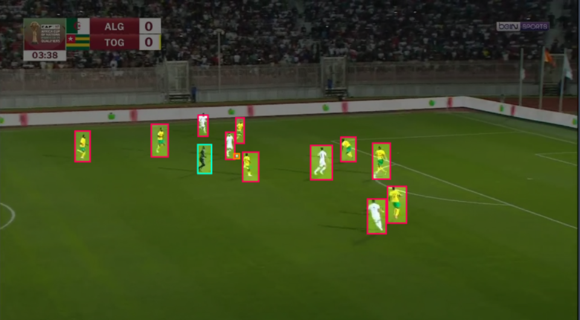
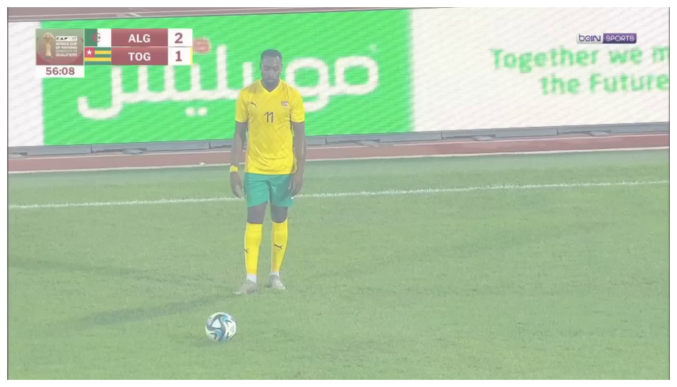
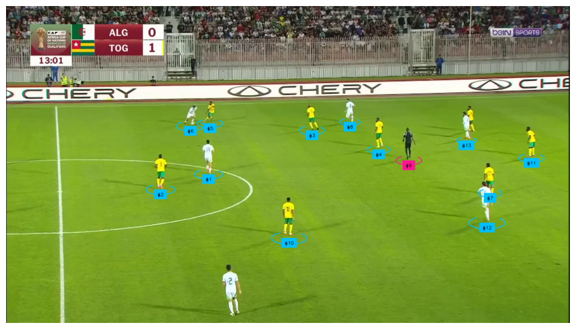
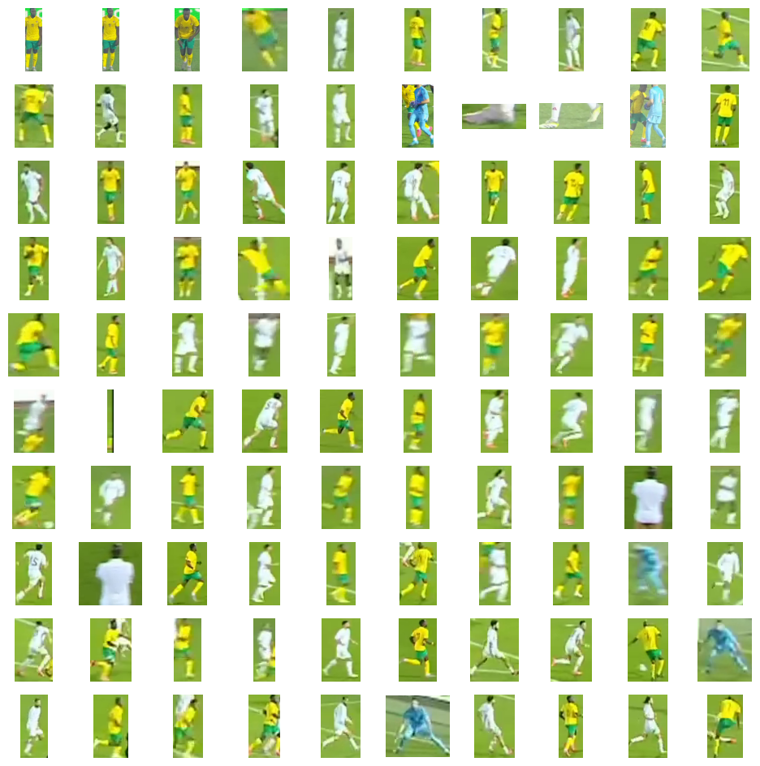

# Football Video Analysis

This project aims to analyze football videos by detecting and tracking players, referees, and the ball. The following key steps are involved:

### Dataset

A custom football video dataset was created and manually annotated.
The dataset includes a variety of football match scenarios, covering different playing conditions and camera angles.
Model Architecture

### YOLO11
YOLOv11, a state-of-the-art object detection and tracking model, was implemented to assign unique IDs to each detected object (player, referee, or ball).
This enables accurate tracking of objects across video frames.
i've trained the model on roboflow.com its better for accuracy and tracking compared to the free gpu of google colab

* Normal Frame

  

* After detections, Tracks,

### Siglip:
A feature extraction model used for K-Means clustering.
YOLOv11: A real-time object detection and tracking model for player and object identification.
Implementation Details

### Clustering:
K-Means clustering was employed to group players into two teams based on their spatial proximity and motion patterns.
Siglip, a powerful feature extraction model, was utilized to extract relevant features for clustering.
Real-Time Tracking:

### Final result:

Here is the final result as we can see we have two diffrent teams with diffrent colors. 

## Conclution:
In conclusion, the football analysis project effectively tracks players, referees, and the ball, allowing for advanced metrics such as player speed, distance covered, and ball control by team. By leveraging player IDs and tracking data, these metrics can be calculated continuously throughout the match. The project can further enhance team and individual performance analysis, helping to drive insights into game strategies and player efficiency.

[by Ben madani Yazid] 
