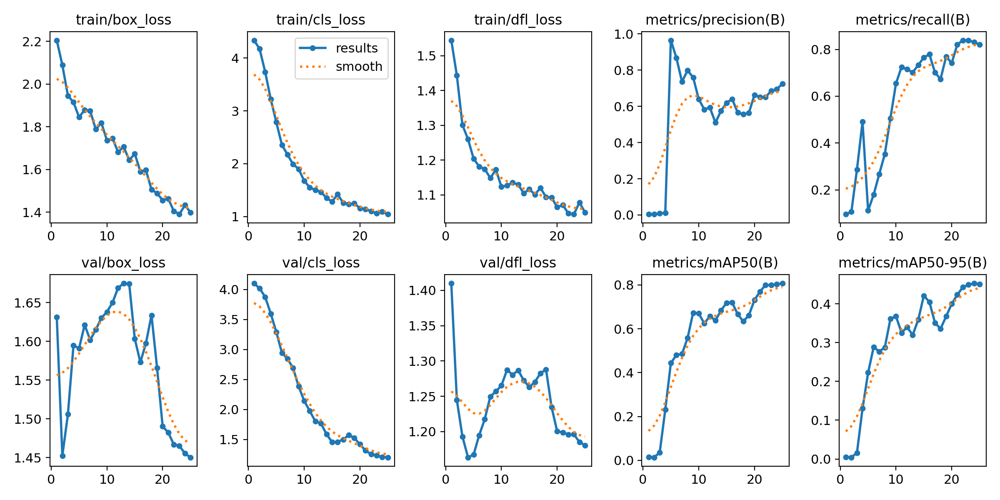
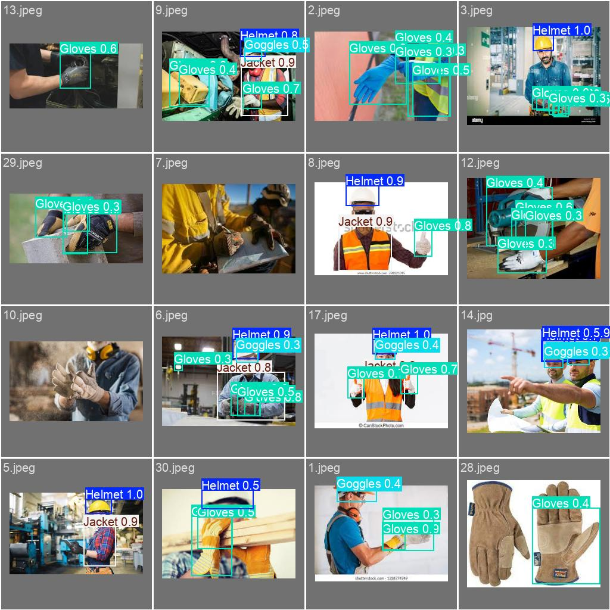
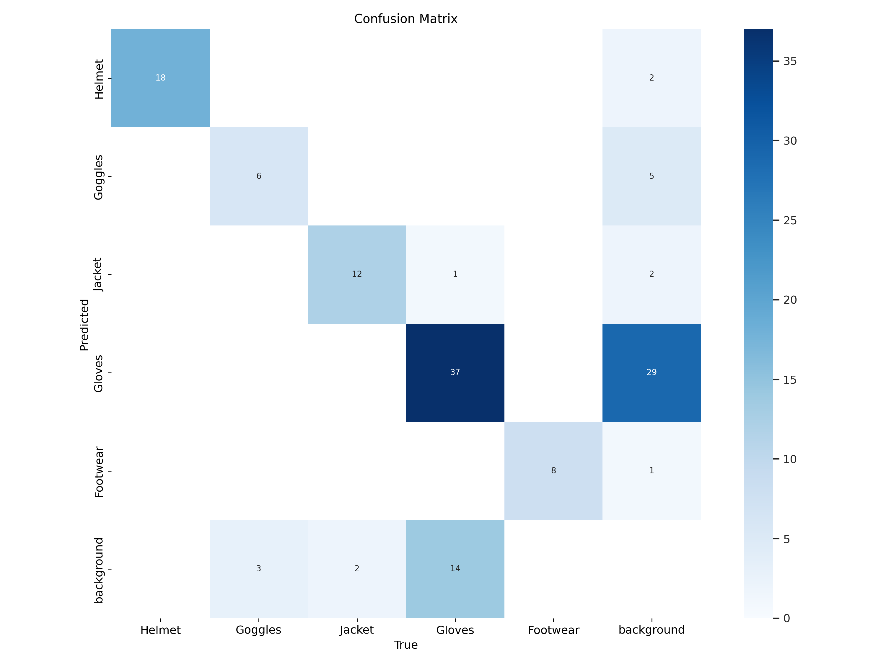

# Object Detection using YOLOv8

## Introduction

This project focuses on detecting safety equipment in images using the YOLOv8 model. The dataset includes categories such as helmets, goggles, jackets, gloves, and footwear. The goal is to train a model to accurately identify and classify these objects within images.

## Data Preparation

The dataset was prepared by encoding and normalizing the images, followed by splitting the data into training and validation  and test sets
## Model Training

The YOLOv8 model was trained on the prepared dataset. The training process included data augmentation, hyperparameter tuning, and the use of optimization techniques to improve detection accuracy. The model was trained for 25 epochs with a batch size of 16.

## Results

### Training Metrics

- **Loss Reduction:** The training loss steadily decreased over epochs, indicating effective learning by the model.
- **Precision and Recall:** Both metrics showed significant improvement over the training period, with recall reaching high values, suggesting the model's effectiveness in identifying objects.

### Validation Metrics

- The model's performance on the validation set was consistent with the training results, demonstrating good generalization. Precision and recall were evaluated for each class.

### Confusion Matrix

- The confusion matrix illustrates the model's performance across different classes, with high accuracy in detecting helmets and jackets but some confusion between gloves and background.

## Conclusion

The YOLOv8 model effectively detects various safety equipment with high precision and recall. The training process and optimization techniques contributed to a robust model capable of generalizing well to unseen data. The final model shows promise for practical applications in safety monitoring and compliance.
